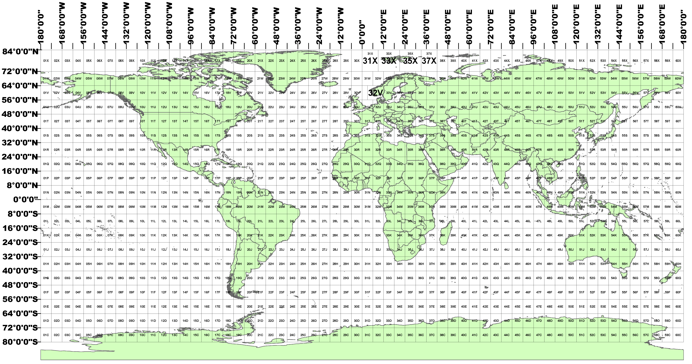

# `sentinel-tiles` Python Package


The `sentinel-tiles` Python package generates raster geometries for the Sentinel version of 100km Military Grid Reference System (MGRS) tiles.

The Julia equivalent of this package is [SentinelTiles.jl](https://github.com/STARS-Data-Fusion/SentinelTiles.jl).

[Gregory H. Halverson](https://github.com/gregory-halverson-jpl) (they/them)<br>
[gregory.h.halverson@jpl.nasa.gov](mailto:gregory.h.halverson@jpl.nasa.gov)<br>
NASA Jet Propulsion Laboratory 329G



## Installation

This package is available on PyPi as a [pip package](https://pypi.org/project/sentinel-tiles/) called `sentinel-tiles` with a dash.

```bash
pip install sentinel-tiles
```

## Usage

Import the tile grid using:

```python
from sentinel_tiles import sentinel_tiles
```

### Basic Operations

#### Get Tile Information

```python
from sentinel_tiles import sentinel_tiles

# Get the bounding box of a tile
bbox = sentinel_tiles.bbox('53NMJ')
print(f"Bounding box: {bbox}")

# Get the footprint polygon of a tile (in geographic coordinates)
footprint = sentinel_tiles.footprint('53NMJ')
print(f"Footprint: {footprint}")

# Get the footprint in UTM coordinates
footprint_utm = sentinel_tiles.footprint_UTM('53NMJ')
print(f"UTM Footprint: {footprint_utm}")

# Get the centroid of a tile
centroid = sentinel_tiles.centroid('53NMJ')
print(f"Centroid: {centroid}")

# Check if a tile contains land
has_land = sentinel_tiles.land('53NMJ')
print(f"Contains land: {has_land}")
```

#### Find Tiles for an Area of Interest

```python
from sentinel_tiles import sentinel_tiles
from shapely.geometry import Point, box

# Find tiles intersecting a point
point = Point(-118.2, 34.5)  # Los Angeles
tiles = sentinel_tiles.tiles(point.buffer(0.5))  # Buffer by 0.5 degrees
print(f"Tiles intersecting area: {tiles}")

# Find tiles intersecting a bounding box
bbox_geom = box(-119, 34, -118, 35)  # Southern California
tiles = sentinel_tiles.tiles(bbox_geom)
print(f"Tiles in bounding box: {tiles}")

# Find the nearest tile to a geometry
nearest_tile = sentinel_tiles.nearest(point)
print(f"Nearest tile: {nearest_tile}")
```

#### Working with Tile Footprints

```python
from sentinel_tiles import sentinel_tiles
import geopandas as gpd
from shapely.geometry import box

# Define area of interest
aoi = box(-119, 34, -118, 35)

# Get detailed footprint information with intersection areas
footprints = sentinel_tiles.tile_footprints(
    aoi,
    calculate_area=True,
    calculate_centroid_distance=True,
    eliminate_redundancy=True
)

print(footprints)
# Returns GeoDataFrame with columns: tile, geometry, area, distance
```

#### Generate Raster Grids

```python
from sentinel_tiles import sentinel_tiles
from shapely.geometry import box

# Create a raster grid for a specific tile
tile_grid = sentinel_tiles.grid('53NMJ', cell_size=30)  # 30m resolution
print(f"Grid shape: {tile_grid.shape}")
print(f"Grid CRS: {tile_grid.crs}")

# Create a grid with a buffer around the tile
buffered_grid = sentinel_tiles.grid('53NMJ', cell_size=30, buffer=1000)  # 1km buffer

# Get grids for all tiles covering an area
aoi = box(-119, 34, -118, 35)
tile_grids = sentinel_tiles.tile_grids(aoi, eliminate_redundancy=True)
print(tile_grids[['tile', 'area', 'grid']])
```

### Advanced Operations

#### Parse Sentinel-2 Granule IDs

```python
from sentinel_tiles import parse_sentinel_granule_id

granule_id = 'S2A_MSIL1C_20170105T013442_N0204_R031_T53NMJ_20170105T013443.SAFE'
metadata = parse_sentinel_granule_id(granule_id)

print(f"Mission: {metadata['mission_id']}")
print(f"Product: {metadata['product']}")
print(f"Date: {metadata['date']}")
print(f"Tile: {metadata['tile']}")
print(f"Orbit: {metadata['orbit']}")
```

#### UTM Projections

```python
from sentinel_tiles import sentinel_tiles, UTM_proj4_from_latlon, UTM_proj4_from_zone

# Get UTM projection from lat/lon
proj4 = UTM_proj4_from_latlon(34.5, -118.2)
print(f"Proj4 string: {proj4}")

# Get UTM projection from zone
proj4 = UTM_proj4_from_zone('11N')
print(f"Proj4 string: {proj4}")

# Get UTM projection for a specific tile
proj4 = sentinel_tiles.UTM_proj4('53NMJ')
print(f"Tile projection: {proj4}")
```

#### Time Conversions

```python
from sentinel_tiles import UTC_to_solar
from datetime import datetime

# Convert UTC time to solar time
utc_time = datetime(2017, 1, 5, 1, 34, 42)
lon = -118.2  # Los Angeles longitude
solar_time = UTC_to_solar(utc_time, lon)
print(f"Solar time: {solar_time}")
```

#### Load GeoJSON as WKT

```python
from sentinel_tiles import load_geojson_as_wkt

# Convert a GeoJSON file to WKT format
wkt = load_geojson_as_wkt('path/to/file.geojson')
print(f"WKT: {wkt}")
```

### Working with Custom Resolutions

```python
from sentinel_tiles import SentinelTileGrid

# Create a custom tile grid with different default resolution
custom_grid = SentinelTileGrid(target_resolution=10)  # 10m resolution

# Generate a 10m resolution grid
high_res_grid = custom_grid.grid('53NMJ')
print(f"High-res grid shape: {high_res_grid.shape}")
```

### Integration with GeoPandas

```python
from sentinel_tiles import sentinel_tiles
import geopandas as gpd
from shapely.geometry import box

# Create a GeoDataFrame for your area of interest
aoi_gdf = gpd.GeoDataFrame(
    geometry=[box(-119, 34, -118, 35)],
    crs='EPSG:4326'
)

# Find tiles intersecting the GeoDataFrame
tiles = sentinel_tiles.tiles(aoi_gdf.unary_union)

# Get detailed footprints as a GeoDataFrame
footprints = sentinel_tiles.tile_footprints(
    aoi_gdf,
    calculate_area=True,
    eliminate_redundancy=True
)

# Save to file
footprints.to_file('sentinel_tiles.geojson', driver='GeoJSON')
```

### Practical Example: Processing Sentinel-2 Data

```python
from shapely.geometry import box
from sentinel_tiles import sentinel_tiles

# Define your study area
study_area = box(-119.5, 34.0, -118.0, 35.0)  # Greater LA area

# Find all relevant tiles (eliminating redundancy)
tiles_df = sentinel_tiles.tile_footprints(
    study_area,
    calculate_area=True,
    eliminate_redundancy=True
)

print(f"Number of tiles needed: {len(tiles_df)}")
print("\nTiles:")
for idx, row in tiles_df.iterrows():
    tile = row['tile']
    area = row['area']
    has_land = sentinel_tiles.land(tile)
    
    print(f"  {tile}: {area/1e6:.2f} km² coverage, Land: {has_land}")
    
    # Create a processing grid for each tile
    tile_grid = sentinel_tiles.grid(tile, cell_size=30)
    print(f"    Grid dimensions: {tile_grid.shape}")
```
